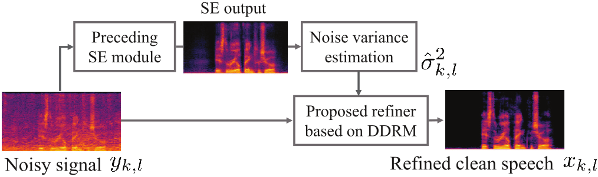

# Diffiner: A Versatile Diffusion-based Generative Refiner for Speech Enhancement (INTERSPEECH 2023)



This repository includes the code implementation for the paper titled "Diffiner: A Versatile Diffusion-based Generative Refiner for Speech Enhancement" presented at INTERSPEECH 2023.

## Abstract
Although deep neural network (DNN)-based speech enhancement (SE) methods outperform the previous non-DNN-based ones, they often degrade the perceptual quality of generated outputs. To tackle this problem, we introduce a DNN-based generative refiner, Diffiner, aiming to improve perceptual speech quality pre-processed by an SE method. We train a diffusion-based generative model by utilizing a dataset consisting of clean speech only.Then, our refiner effectively mixes clean parts newly generated via denoising diffusion restoration into the degraded and distorted parts caused by a preceding SE method, resulting in refined speech. Once our refiner is trained on a set of clean speech, it can be applied to various SE methods without additional training specialized for each SE module. Therefore, our refiner can be a versatile post-processing module w.r.t. SE methods and has high potential in terms of modularity.

## Paper

[Paper on arXiv](https://arxiv.org/abs/2210.17287v2)

[Paper on archive of Interspeech 2023](https://www.isca-speech.org/archive/interspeech_2023/sawata23_interspeech.html)

[Creative AI: Demo and Papers, Sony Group Corporation](https://sony.github.io/creativeai/)

## Authors
Ryosuke Sawata<sup>1</sup>, Naoki Murata<sup>2</sup>, Yuhta Takida<sup>2</sup>, Toshimitsu Uesaka<sup>2</sup>, Takashi Shibuya<sup>2</sup>, Shusuke Takahashi<sup>1</sup>, Yuki Mitsufuji<sup>1, 2</sup>

<sup>1</sup> Sony Group Corporation, <sup>2</sup> Sony AI

# Getting started
## Installation using Docker
To set up the environment, we provide a Dockerfile.
### Building the Docker Image
In the working directroy (e.g., `diffiner/`), execute the following command:
```
docker build -t diffiner -f Dockerfile_torch1p11_diffiner .
```
### Starting a Docker Container
run the command:
```
bash start-container-torch1p11_ddgm_se.sh
```
Please modify `start-container-torch1p11_diffiner.sh` script to match your environment.

# Training
You can train a diffusion model for the complex spectrograms using `train.py`. 
```
python scripts/train.py --root dir_train_wav --image_size 256 --num_channels 128 --num_res_blocks 3 --diffusion_steps 4000 --noise_schedule linear --lr 1e-4 --batch_size 2
```
The number of frequency bins and time steps in the complex spectrogram are determined by the `--imaze_size` parameter. 

### Training data
The training data should be placed in the `dir_train_wav` directroy, containing the required `.wav` files for training.

### Parameters
For detaild information reagrding the parameters to be specified during training, please refer to the [Arguments.md](./Arguments.md).

## Pre-trained model
We offer a pre-trained model that can be downloaded from [here](https://zenodo.org/record/7988790). 

# Run Diffiner/Diffiner+ (Inference)
After training and preceding SE, you can run Diffiner/Diffiner+ as follows:
```
python scripts/run_refiner.py --root-noisy [dir to noisy] --root-proc [dir to pre-processed by preceding SE] --model-path [dir to the trained *.pt]
```
The default mode is running `Diffiner+`, but you can switch to `Diffiner` by just adding the option `--simple-diffiner`. The results processed by Diffiner/Diffiner+ will be stored in `[dir to pre-processed by preceding SE]/[diffiner or diffiner+]_etaA=***_etaB=***_etaC=***_etaD=***`, which it is automatically made when running this script. Note that the values actually used to run `run_refiner.py` will be automatically substituted for `***` of the name of result directory. All necessary parameters, e.g., $\eta_a$ and $\eta_b$, are defaultly set so as to be same as our experiments. The details of all required parameters to run Diffiner/Diffiner+ are given in the [Arguments.md](./Arguments.md).

# Examples of refinement on VoiceBank+Demand
You can easily run the pre-trained Diffiner+ on VoiceBank+Demand corpus, which it is pre-processed by Deep Complex U-net (DCUnet):
```
./run_example.sh
```
First of all, downloading VoiceBank+Demand corpus, its pre-processed results by DCUnet, and our pre-trained diffiner will start. The all of audio files will be defaultly stored in `./data`, and the pre-trained model weights of diffiner will be stored in your current directory. Note that both DCUnet and diffiner were trained on VoiceBank+Demand corpus only, which this settings were adopoted in our paper's experiments. After that, running the pre-trained Diffiner+ on VoiceBank+Demand corpus pre-processed by the aforementioned DCUnet will nextly start. Finally, you can get examples refined by Diffiner+ in `./data/proc_dcunet/[results of Diffiner+]`.

## Citation
If you find this work useful, please consider citing the paper:
```
@inproceedings{sawata23_interspeech,
  author={Ryosuke Sawata and Naoki Murata and Yuhta Takida and Toshimitsu Uesaka and Takashi Shibuya and Shusuke Takahashi and Yuki Mitsufuji},
  title={{Diffiner: A Versatile Diffusion-based Generative Refiner for Speech Enhancement}},
  year=2023,
  booktitle={Proc. INTERSPEECH 2023},
  pages={3824--3828},
  doi={10.21437/Interspeech.2023-1547}
}
```

This repository is based on [openai/guided-diffusion](https://github.com/openai/guided-diffusion).
